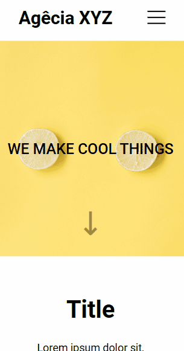

# Agência XYZ

Exercício proposto de HTML + CSS para criação de uma landing page de uma agência fictícia.

## Tabela de Conteúdo

- [Propósito](#propósito)
- [Screenshot](#screenshot)
- [Ferramentas](#ferramentas)
- [Autora](#autora)

## Propósito

O propósito desse projeto foi aprofundar os conhecimentos em CSS, utilizando o Grid Template Areas para customizar a página. 
Também obteve-se um site responsivo, o qual na versão Mobile ganhou um "menu hamburguer" para agrupar as seções da página.

## Screenshot

### Mobile

### Desktop

## Ferramentas

- HTML com semântica
- Estilização com CSS
- Responsibilidade 

## Autora

- LinkedIn - [Camila Katayama](https://www.linkedin.com/in/camila-katayama-ab1a42153/)
- GitHub - [@camilakataa](https://github.com/camilakataa)

